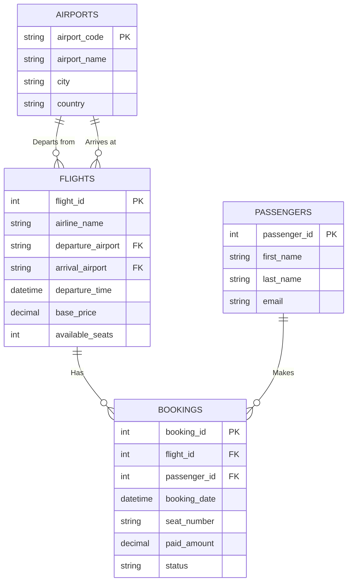

# DBMS Mini-Project: Airline Management System

## 1. Problem Statement and Scope
The goal of this project is to design and implement a relational database for an **Airline Management System**. 
The system aims to manage core airline operations efficiently. Its scope includes:
- Managing **Airports** and their locations.
- Scheduling **Flights** between airports, tracking airlines, dates, and pricing.
- Maintaining **Passenger** records and contact information.
- Processing **Bookings** to link passengers to specific flights and track ticket statuses.

---

## 2. Entity-Relationship (ER) Diagram

Below is the logical Entity-Relationship model representing the entities, their attributes, and relationships.



---

## 3. Schema Design & Normalization (1NF to 3NF)

To eliminate data redundancy and update anomalies, the database schema undergoes the normalization process up to the Third Normal Form (3NF).

### Unnormalized Form (UNF)
Imagine an initial flat-file spreadsheet capturing all booking details:
`[booking_id, flight_id, airline_name, departure_city, arrival_city, passenger_id, passenger_name, passenger_email, booking_date, seat_number, status]`
- *Issues*: High redundancy. Updating a passenger's email means updating every booking they've made. Updating an airline's flight route requires modifying multiple rows.

### First Normal Form (1NF)
**Rule**: Eliminate repeating groups, ensure atomicity of attributes, and define a Primary Key.
- We separate `passenger_name` into `first_name` and `last_name` to ensure atomicity.
- Each row is now uniquely identifiable by `booking_id`.

### Second Normal Form (2NF)
**Rule**: Must be in 1NF and have no partial dependencies (attributes must depend on the *entire* primary key).
Because our flat design uses `booking_id` as the primary key, attributes like `passenger_email` depend entirely on the passenger making the booking, not the booking itself. `airline_name` depends on the flight, not the booking.
- *Action*: We decompose the data into distinct entities: **Passengers**, **Flights**, and **Bookings**.

### Third Normal Form (3NF)
**Rule**: Must be in 2NF and have no transitive dependencies (non-key attributes cannot depend on other non-key attributes).
If we had `departure_airport_code` and `departure_city` inside the **Flights** table, `departure_city` would depend on `departure_airport_code` (a non-key attribute) rather than `flight_id` (the primary key).
- *Action*: We create a separate **Airports** table to handle airport details independently of flights. 

### Final 3NF Relational Tables
This process results in our highly normalized, current schema structure:

1. **Airports** (`airport_code` PK, `airport_name`, `city`, `country`)
2. **Passengers** (`passenger_id` PK, `first_name`, `last_name`, `email` UNIQUE)
3. **Flights** (`flight_id` PK, `airline_name`, `departure_airport` FK, `arrival_airport` FK, `departure_time`, `base_price` CHECK constraints applied, `available_seats` CHECK constraints applied)
4. **Bookings** (`booking_id` PK, `flight_id` FK, `passenger_id` FK, `booking_date`, `seat_number`, `paid_amount`, `status`)

---

## 4. Advanced Database Objects (Triggers, Views & Procedures)

To ensure robust data integrity and offload business logic to the database layer, the following advanced objects were implemented:

### View: `FlightDetailsView`
A virtual table that pre-joins `Flights` with `Airports` to provide a clean, human-readable layout of flight routes, hiding the complexity of `JOIN` queries from the application layer.

### Stored Procedure: `BookFlightTicket`
A transaction-safe block of code that takes passenger details and a flight ID. It automatically:
1. Checks if the passenger exists (and creates them if not).
2. Attempts to insert the booking record.

### Triggers: Seat Availability & Pricing Logic
- **`Before_Booking_Insert`**: Fires *before* a booking is made. It checks if the `available_seats` for the flight are greater than 0. If seats are sold out, it throws a database error to stop the booking. Otherwise, it locks in the historical price by copying `Flights.base_price` into `Bookings.paid_amount`.
- **`After_Booking_Insert`**: Fires *after* a successful booking to automatically decrement `available_seats` by 1.

---

## 5. Data Retrieval & Insights (Complex Queries)

To fulfill the analytical requirements, the following five complex queries were developed to extract meaningful business insights:

1. **Revenue Analysis by Airline (Aggregates + Joins)**
   *Find the total revenue generated by each airline.*
   ```sql
   SELECT f.airline_name, SUM(b.paid_amount) AS total_revenue
   FROM Bookings b
   JOIN Flights f ON b.flight_id = f.flight_id
   GROUP BY f.airline_name
   ORDER BY total_revenue DESC;
   ```

2. **Busiest Flight Routes (Joins + Counting + Grouping)**
   *Identify routes with the highest number of bookings.*
   ```sql
   SELECT a1.city AS departure, a2.city AS arrival, COUNT(b.booking_id) AS ticket_count
   FROM Bookings b
   JOIN Flights f ON b.flight_id = f.flight_id
   JOIN Airports a1 ON f.departure_airport = a1.airport_code
   JOIN Airports a2 ON f.arrival_airport = a2.airport_code
   GROUP BY departure, arrival
   ORDER BY ticket_count DESC;
   ```

3. **High-Value Customers (Joins + Aggregates + Sorting)**
   *List the top 5 passengers based on their total spending.*
   ```sql
   SELECT p.first_name, p.last_name, SUM(b.paid_amount) AS lifetime_value
   FROM Passengers p
   JOIN Bookings b ON p.passenger_id = b.passenger_id
   GROUP BY p.passenger_id
   ORDER BY lifetime_value DESC
   LIMIT 5;
   ```

4. **Flights with Below-Average Occupancy (Subqueries)**
   *Find flights that are performing below the system-wide average occupancy.*
   ```sql
   SELECT flight_id, airline_name, (150 - available_seats) AS current_passengers
   FROM Flights
   WHERE (150 - available_seats) < (
       SELECT AVG(150 - available_seats) FROM Flights
   );
   ```

5. **Monthly Booking Trends (Date Functions + Aggregates)**
   *Track how many bookings are made each month to identify seasonal trends.*
   ```sql
   SELECT MONTHNAME(booking_date) AS month, COUNT(*) AS volume
   FROM Bookings
   WHERE YEAR(booking_date) = YEAR(CURDATE())
   GROUP BY month
   ORDER BY month(STR_TO_DATE(month, '%M'));
   ```
